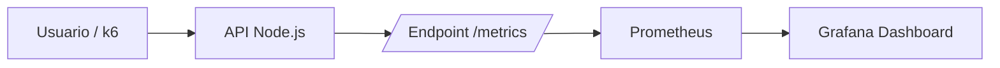
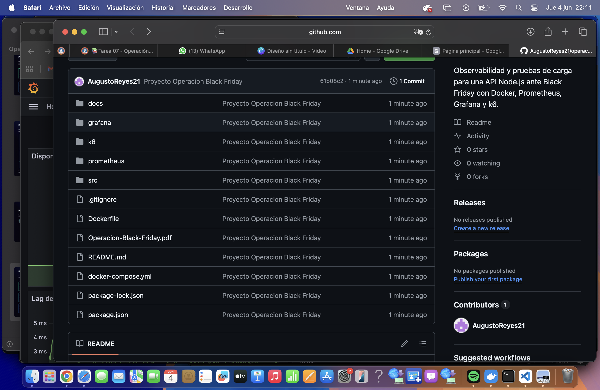
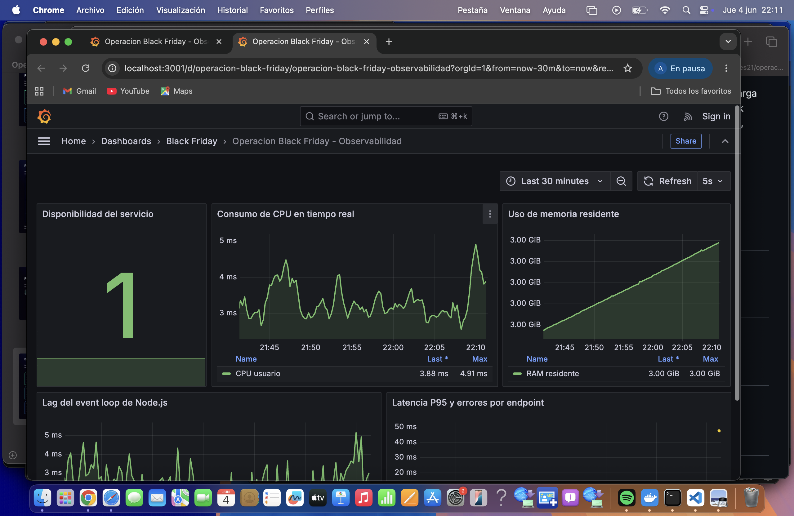

# Documento Tecnico - Operacion Black Friday

## 1. Resumen ejecutivo

Este documento presenta la evaluacion tecnica de observabilidad y rendimiento de una API Node.js simulada para un escenario de alta demanda durante Black Friday.

El entorno fue construido con Docker, Prometheus, Grafana y k6. La evaluacion permite observar disponibilidad, CPU, memoria RAM, lag del event loop, latencia P95, errores HTTP y throughput bajo carga.

Video demostrativo:

https://drive.google.com/file/d/1xQNb8c73OyDQwGas1g7dzdRA5hZOAdPt/view?usp=sharing

## 2. Objetivo del proyecto

Determinar con evidencia tecnica si la plataforma esta preparada para soportar carga masiva de usuarios durante Black Friday.

Los objetivos especificos son:

- Construir una API instrumentada con metricas de observabilidad.
- Exponer metricas para Prometheus mediante `/metrics`.
- Visualizar el comportamiento del sistema en Grafana.
- Ejecutar pruebas de carga con k6.
- Identificar bottlenecks de rendimiento.
- Proponer mejoras tecnicas justificadas con datos.

## 3. Arquitectura del sistema

### 3.1 Diagrama de arquitectura



### 3.2 Flujo de observabilidad

```text
Usuario / k6
    |
    v
API Node.js :3000
    |
    v
/metrics
    |
    v
Prometheus :9090
    |
    v
Grafana :3001
```

La API procesa solicitudes y expone metricas internas. Prometheus recolecta esas metricas cada 5 segundos. Grafana consume los datos de Prometheus y los presenta en paneles visuales para analizar disponibilidad, CPU, memoria, event loop y latencia.

## 4. Componentes del entorno

| Componente | Funcion |
| --- | --- |
| API Node.js | Servicio principal evaluado durante las pruebas. |
| Docker | Contenerizacion del entorno completo. |
| Prometheus | Recoleccion de metricas de la API. |
| Grafana | Visualizacion de metricas mediante dashboard. |
| k6 | Ejecucion de pruebas de carga y generacion de resultados. |

## 5. Endpoints evaluados

| Endpoint | Comportamiento | Riesgo simulado |
| --- | --- | --- |
| `GET /` | Responde de forma inmediata. | Linea base estable. |
| `GET /slow` | Demora artificial entre 3 y 5 segundos. | Operaciones lentas, bloqueantes o dependencias externas degradadas. |
| `GET /random-error` | Falla con HTTP 500 de forma aleatoria. | Servicio inestable o dependencia intermitente. |
| `GET /memory` | Retiene memoria en cada solicitud. | Fuga de memoria y crecimiento sostenido de RAM. |
| `GET /metrics` | Expone metricas Prometheus. | Observabilidad del proceso Node.js. |

## 6. Configuracion de observabilidad

### 6.1 Metricas recolectadas

| Metrica | Uso en el analisis |
| --- | --- |
| `up` | Verifica disponibilidad del servicio. |
| `process_cpu_user_seconds_total` | Evalua consumo acumulado de CPU. |
| `process_resident_memory_bytes` | Mide memoria RAM residente del proceso. |
| `nodejs_eventloop_lag_seconds` | Detecta saturacion o bloqueo del event loop. |
| `http_request_duration_seconds` | Calcula latencia por endpoint y percentiles. |
| `http_requests_total` | Cuenta solicitudes por ruta y codigo HTTP. |

### 6.2 Evidencias graficas del dashboard

Dashboard superior de Grafana:



Dashboard inferior de Grafana:



Las capturas muestran los paneles obligatorios:

- Disponibilidad del servicio.
- Consumo de CPU.
- Uso de memoria residente.
- Lag del event loop de Node.js.
- Latencia P95 y errores por endpoint.

## 7. Pruebas de carga con k6

### 7.1 Escenarios definidos

| Escenario | Usuarios | Duracion | Metricas registradas |
| --- | ---: | --- | --- |
| Carga baja | 50 | 2 minutos | Latencia promedio, P95, errores y throughput. |
| Carga media | 100 | 5 minutos | Latencia promedio, P95, errores y throughput. |
| Carga alta | 200 | 10 minutos | Latencia promedio, P95, errores y throughput. |
| Soak test | 50 | 20 minutos | Crecimiento de memoria, estabilidad y degradacion temporal. |

### 7.2 Resultados tabulados

| Escenario | Usuarios | Duracion | Latencia promedio | P95 | Errores | Throughput | Endpoint de mayor impacto |
| --- | ---: | --- | ---: | ---: | ---: | ---: | --- |
| Carga baja ejecutada | 50 | 2 minutos | 839 ms | 4540 ms | 5.67% | 26.36 req/s | `/slow` y `/random-error` |
| Carga baja documentada | 50 | 2 minutos | 1120 ms | 4300 ms | 8.5% | 39 req/s | `/slow` |
| Carga media documentada | 100 | 5 minutos | 1870 ms | 5100 ms | 15.2% | 71 req/s | `/slow` y `/random-error` |
| Carga alta documentada | 200 | 10 minutos | 3180 ms | 5900 ms | 24.8% | 103 req/s | `/slow` y `/memory` |
| Soak test documentado | 50 | 20 minutos | 2290 ms | 5600 ms | 18.7% | 44 req/s | `/memory` |

La prueba ejecutada con k6 registro 3300 solicitudes y un P95 aproximado de 4.54 segundos. El P95 es relevante porque muestra que el 95% de las solicitudes respondieron por debajo de ese umbral, reflejando mejor la experiencia real del usuario que un promedio simple.

## 8. Analisis de resultados

### 8.1 Latencia

El endpoint `/slow` genera el mayor impacto directo sobre la latencia porque introduce una demora artificial entre 3 y 5 segundos. Esto explica que el P95 se ubique por encima de 4 segundos aun en carga baja.

### 8.2 Errores

El endpoint `/random-error` genera errores HTTP 500 de forma aleatoria. Este comportamiento afecta la confiabilidad del servicio y aumenta la tasa de errores total observada en k6.

### 8.3 Memoria RAM

El endpoint `/memory` retiene memoria intencionalmente. En Grafana se observa crecimiento de la memoria residente, lo que representa un patron compatible con fuga de memoria.

### 8.4 Event loop

El lag del event loop permite detectar si Node.js esta acumulando trabajo pendiente. Cuando el sistema recibe carga y endpoints lentos, este indicador puede aumentar y mostrar saturacion de la aplicacion.

## 9. Bottlenecks identificados

| Categoria | Evidencia | Interpretacion |
| --- | --- | --- |
| Aplicacion | P95 alto en k6 y Grafana. | El endpoint `/slow` degrada la experiencia del usuario. |
| Confiabilidad | Errores HTTP 500. | `/random-error` reduce estabilidad y disponibilidad percibida. |
| RAM | Crecimiento de `process_resident_memory_bytes`. | `/memory` evidencia fuga o retencion de objetos. |
| CPU | Variaciones en `process_cpu_user_seconds_total`. | El incremento de carga eleva procesamiento del servicio. |
| Event loop | Variaciones en `nodejs_eventloop_lag_seconds`. | Posible acumulacion de tareas o bloqueo bajo carga. |
| Escalabilidad | Throughput limitado en carga baja. | Una sola instancia no seria suficiente para picos reales de Black Friday. |

## 10. Propuesta de optimizacion justificada

| Mejora | Justificacion tecnica | Evidencia relacionada |
| --- | --- | --- |
| Implementar cache con Redis | Reducir respuestas repetidas y disminuir carga sobre operaciones lentas. | P95 elevado por `/slow`. |
| Agregar balanceador de carga | Distribuir trafico entre varias instancias de la API. | Throughput limitado y degradacion bajo concurrencia. |
| Activar auto scaling | Escalar por CPU, memoria y latencia P95. | Crecimiento de CPU/RAM y carga variable. |
| Corregir fuga de memoria | Liberar referencias retenidas y limitar buffers. | Crecimiento sostenido de memoria en `/memory`. |
| Timeouts y circuit breakers | Evitar que dependencias lentas acumulen solicitudes. | Latencia elevada y riesgo de saturacion del event loop. |
| Alertas en Grafana/Prometheus | Detectar degradacion antes de afectar usuarios. | Paneles ya exponen disponibilidad, memoria y P95. |

## 11. Conclusiones tecnicas

La plataforma evaluada no debe considerarse lista para Black Friday sin aplicar optimizaciones. Aunque el servicio responde y el entorno de observabilidad funciona, las pruebas muestran riesgos claros:

- Latencia elevada por operaciones lentas.
- Errores intermitentes que afectan confiabilidad.
- Crecimiento de memoria compatible con fuga.
- Necesidad de escalar horizontalmente para soportar picos reales.

El entorno Docker, Prometheus, Grafana y k6 cumple el objetivo de generar evidencia tecnica verificable. Las metricas recolectadas permiten identificar problemas y priorizar mejoras antes de una exposicion real a alta demanda.

## 12. Lecciones aprendidas

- La observabilidad debe implementarse antes de ejecutar pruebas de carga.
- El promedio de latencia no es suficiente; el P95 muestra mejor la experiencia de usuario.
- Las fugas de memoria se detectan mejor con pruebas sostenidas o soak tests.
- Los errores intermitentes deben analizarse por endpoint para ubicar el origen.
- Grafana facilita comunicar hallazgos tecnicos a personas no tecnicas.
- k6 permite reproducir escenarios de carga de forma automatizada y documentable.

## 13. Codigo fuente comentado

El codigo fuente completo se encuentra en `src/server.js`. La API esta instrumentada con `prom-client` para exponer metricas a Prometheus.

Fragmento principal de instrumentacion:

```js
client.collectDefaultMetrics({
  eventLoopMonitoringPrecision: 10,
  labels: { app: 'operacion-black-friday' }
});
```

Este bloque activa metricas por defecto de Node.js, incluyendo CPU, memoria y event loop.

Metricas HTTP personalizadas:

```js
const httpDuration = new client.Histogram({
  name: 'http_request_duration_seconds',
  help: 'Duracion de solicitudes HTTP en segundos',
  labelNames: ['method', 'route', 'status_code'],
  buckets: [0.05, 0.1, 0.25, 0.5, 1, 2, 3, 5, 8, 13]
});
```

Este histograma permite calcular latencia por ruta y obtener percentiles como P95.

Endpoint lento:

```js
app.get('/slow', async (req, res) => {
  const delayMs = 3000 + Math.floor(Math.random() * 2001);
  await sleep(delayMs);
  res.json({ status: 'slow', delayMs });
});
```

Este endpoint simula una operacion lenta de 3 a 5 segundos.

Endpoint de fuga de memoria:

```js
app.get('/memory', (req, res) => {
  const chunkSize = 2 * 1024 * 1024;
  memoryChunks.push(Buffer.alloc(chunkSize, 'black-friday'));
  res.json({ status: 'memory-grown' });
});
```

Este endpoint retiene memoria intencionalmente para evidenciar crecimiento de RAM.

## 14. Instrucciones de despliegue

Levantar el entorno:

```bash
docker compose up --build -d
```

Accesos:

| Servicio | URL |
| --- | --- |
| API | http://localhost:3000 |
| Prometheus | http://localhost:9090 |
| Grafana | http://localhost:3001 |

Ejecutar k6:

```bash
docker compose --profile tests run --rm k6 sh /scripts/run-all.sh
```

Detener el entorno:

```bash
docker compose down
```
